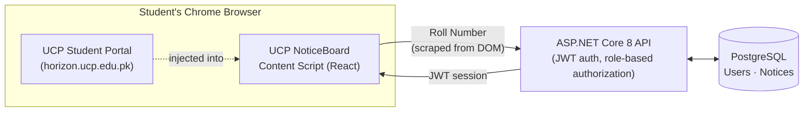

# UCP NoticeBoard

**A Chrome extension that turns the UCP Student Portal into a live campus notice board — no separate login, no app to check, no admin overhead beyond approving publishers.**


---

## What it is

UCP NoticeBoard injects a native-feeling notice feed directly into the UCP Student Portal dashboard the moment a student logs in — no separate account, no browser popup, no extra password. It reads the Roll Number the portal already displays, silently identifies the student against the backend, and renders a horizontally-scrolling carousel of notices right above the Classes/Grades section.

Behind that simple experience is a full three-tier system: a Manifest V3 Chrome extension, an ASP.NET Core 8 API, and a PostgreSQL database — built as a real deployable product, not a toy demo.

## Why it's interesting (the actual engineering)

- **Identity without a login screen.** The extension has no sign-in flow at all. It scrapes the student's Roll Number from the portal's own DOM (the only reliable identity signal the portal exposes) and treats an authenticated portal session as the trust boundary — the same way any embedded tool inherits trust from its host page.
- **Self-healing role assignment.** The designated Admin's role is re-verified on *every* login, not just at account creation — so a stale or misconfigured account can never get permanently stuck with the wrong permissions.
- **Zero client-side session caching, on purpose.** Every page load re-identifies the user against the backend instead of trusting a cached session. It costs one lightweight request; in exchange, a role change by the Admin takes effect on the student's very next page load, with no manual cache-clearing required.
- **Soft-expiry, not deletion.** Notices older than 7 days are filtered out of every query, not deleted — nothing is ever silently lost, and the cutoff is a single constant to tune.
- **Ownership enforced twice.** A Publisher can only edit/delete their own notices — enforced both in the UI (buttons simply don't render) and independently in the API (a request forged past the UI still gets rejected). The Admin bypasses both, by design.

## Features

| Role | Capabilities |
|---|---|
| **Student** | Sees the notice carousel automatically — zero setup, zero login |
| **Publisher** | Create / edit / delete their own notices, each with title, description, and poster image |
| **Admin** | Everything a Publisher can do, on *any* notice, plus user management (add Publishers by Roll Number, change any role) and a live usage-analytics dashboard |

- Responsive carousel — 4+ notices visible on desktop, swipeable single-card view on mobile
- Poster images with graceful fallback for text-only notices
- 7-day automatic expiry, newest-first ordering
- Built-in analytics: total users by role, total dashboard views, active-in-last-7-days
- Ships with a Dockerfile — deploys to any container host in one push

## Architecture



## Tech stack

**Extension** — Chrome Extension (Manifest V3) · React 18 · TypeScript · Vite
**Backend** — ASP.NET Core 8 Web API · Entity Framework Core · JWT authentication
**Database** — PostgreSQL
**Deployment** — Docker · Railway

## Screenshots

> _Add screenshots of the injected carousel, the notice detail view, and the Admin analytics panel here._

## Getting started

Full setup — local development, database migrations, and step-by-step production deployment — is documented separately:

- [`SETUP.md`](./SETUP.md) — local dev environment, one step at a time
- [`DEPLOYMENT.md`](./DEPLOYMENT.md) — deploying the API + database, and publishing the extension

Quick version, for anyone who just wants to see it run:

```bash
# Backend
cd backend/UCPNoticeBoard.Api
dotnet restore
dotnet ef database update
dotnet run

# Extension
cd extension
npm install
npm run build
# then load /extension/dist as an unpacked extension in chrome://extensions
```

## API overview

| Method | Route | Auth | Purpose |
|---|---|---|---|
| `POST` | `/login` | — | Identify/register a user by Roll Number |
| `GET` | `/notices` | any user | Active notices (last 7 days), newest first |
| `POST` | `/notices` | Publisher, Admin | Create a notice |
| `PUT` / `DELETE` | `/notices/{id}` | owner or Admin | Edit / remove a notice |
| `GET` / `POST` | `/users` | Admin | List users / add a Publisher |
| `PATCH` | `/users/{id}/role` | Admin | Change a user's role |
| `GET` | `/analytics/summary` | Admin | Usage statistics |

## Project structure

```
UCP-NoticeBoard/
├── extension/            Chrome Extension — MV3, React, TypeScript, Vite
│   └── src/
│       ├── content/       Injected UI: entry point, root component, identity scraper
│       ├── components/    NoticeFeed, NoticeCard, NoticeManager, AdminPanel, AnalyticsPanel
│       ├── api/            Backend API client
│       └── types/
└── backend/               ASP.NET Core 8 Web API
    └── UCPNoticeBoard.Api/
        ├── Controllers/    Auth, Users, Notices, Analytics
        ├── Models/
        ├── Data/           EF Core DbContext
        ├── Services/       JWT token issuing
        └── Migrations/
```

## Roadmap

- [ ] Real image uploads (currently poster images are URL-based, to keep the MVP scope tight)
- [ ] Push-style notifications for new notices
- [ ] Public Chrome Web Store listing, pending university sign-off on branding/data handling

## License

MIT — see [`LICENSE`](./LICENSE).

---

Built by [Muhammad Saad Nazir](https://github.com/saad-nazir-0289) — B.Sc. Computer Science, University of Central Punjab.
