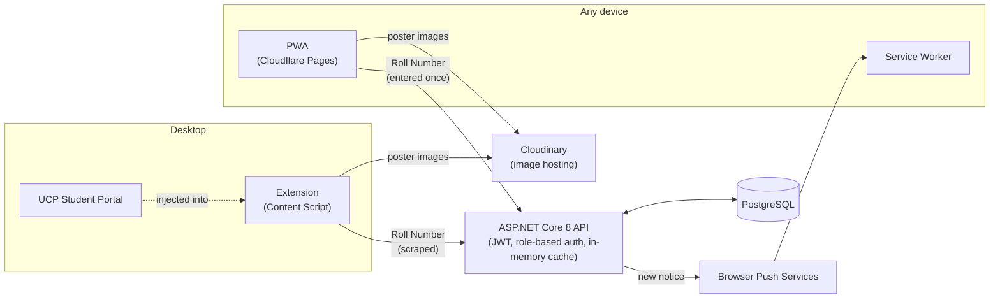

# UCP NoticeBoard

**A Chrome extension and companion mobile site that turn campus notices into something students actually see — no separate login, no app to remember to check, no admin overhead beyond approving publishers.**

[](https://chromewebstore.google.com/detail/dmkdgckajefikfbbfblihmnamjiaemfg?utm_source=item-share-cb)


**[Install the extension](https://chromewebstore.google.com/detail/dmkdgckajefikfbbfblihmnamjiaemfg?utm_source=item-share-cb)** · **[Open the mobile site](https://ucp-noticeboard.msndev.workers.dev/)** · [Privacy Policy](./PRIVACY.md)

---

## What it is

UCP NoticeBoard injects a native-feeling notice feed directly into the UCP Student Portal dashboard the moment a student opens it — no separate account, no browser popup, no extra password. It reads the Roll Number the portal already displays, silently identifies the student against the backend, and renders a scrollable feed of notices right above the Classes/Grades section.

For students who mostly aren't on a desktop, the same notices live on a standalone mobile-friendly site — a real installable PWA with push notifications, sharing, and a proper mobile feed (swipe-to-dismiss included), so nobody has to be at a laptop to stay in the loop.

Behind both is one shared system: a Manifest V3 Chrome extension, a standalone React PWA, an ASP.NET Core 8 API, and a PostgreSQL database.

## Why it's interesting (the actual engineering)

- **Identity without a login screen, on two different surfaces.** The extension scrapes the student's Roll Number straight off the portal's own DOM — zero clicks, ever. The PWA can't do that trick (it isn't embedded in the portal), so it asks once, on first use per device, and never again.
- **A Roll Number alone only ever grants read-only access — on purpose.** Roll Numbers are visible on the portal and often near-sequential between classmates, so they're treated as identity but never as proof of permission. Publisher and Admin access both require a separate one-time secret activation link, generated by the Admin and shared out-of-band — closing off what would otherwise be a trivially guessable privilege-escalation path.
- **Names are locked after creation, for the same reason.** A display name is only ever trusted at the moment an account is first created; no later request can silently overwrite it. This was a real bug found during testing — a client could rename any existing user just by guessing their Roll Number — fixed by treating "who created this" the same way as "who's allowed to publish."
- **Zero client-side session caching, on purpose.** Every page load re-identifies the user against the backend instead of trusting a cached session. It costs one lightweight request; in exchange, a role change by the Admin takes effect on the very next page load, with no manual cache-clearing required.
- **First paint costs one round trip, not two.** `/login` returns the first batch of notices and categories bundled directly in its response, so the feed can render immediately instead of waiting on a second network call after identification completes.
- **Soft-expiry, not deletion.** Notices disappear from the student feed once their deadline passes (or 7 days after posting, if no deadline was set) — but they're never deleted. Admin/Publisher management views deliberately bypass this filter, so nothing old is ever unreviewable or unrecoverable.
- **Push notifications without a login-dependent backend service.** The extension has no way to hold a push subscription itself (it only exists inside the portal page), so its notification bell opens the PWA instead — the one surface that's a real, standalone webpage with an actual service worker — and auto-triggers the permission prompt on arrival, so it still only takes one tap.
- **Ownership enforced twice.** A Publisher can only edit/delete their own notices — enforced both in the UI (buttons simply don't render) and independently in the API (a request forged past the UI still gets rejected). The Admin bypasses both, by design.

## Features

| Role | Capabilities |
|---|---|
| **Student** | Sees the notice feed automatically — zero setup, zero login. Search, filter by category, switch between card/list view, dismiss notices they don't want to see, share any notice via a real link |
| **Publisher** | Create / edit / delete their own notices — title, description, poster image, external link, category, and an optional deadline |
| **Admin** | Everything a Publisher can do, on *any* notice, plus user management (add Publishers via one-time activation links, change any role, correct a name), category management, and a live usage-analytics dashboard |

- Poster images uploaded directly from the browser to Cloudinary — never touch the backend, so it costs nothing regardless of upload volume
- Push notifications (standard Web Push/VAPID — no third-party push service) sent to every subscriber when a Publisher posts
- Shareable links that work for anyone, even someone who's never opened the app before — they land straight in onboarding, then the specific notice
- Soft 7-day (or custom deadline) expiry — hidden from students, always recoverable by Admin/Publisher
- Built-in analytics: total users by role, total dashboard views, active-in-last-7-days
- Ships with a Dockerfile — deploys to any container host in one push

## Architecture


```mermaid
flowchart LR
    subgraph Desktop["Desktop"]
        Portal["UCP Student Portal"]
        Ext["Extension\n(Content Script)"]
        Portal -. injected into .-> Ext
    end

    subgraph Mobile["Any device"]
        PWA["PWA\n(Cloudflare Pages)"]
        SW["Service Worker"]
    end

    API["ASP.NET Core 8 API\n(JWT, role-based auth, in-memory cache)"]
    DB[("PostgreSQL")]
    Cloudinary["Cloudinary\n(image hosting)"]
    Push["Browser Push Services"]

    Ext -- "Roll Number\n(scraped)" --> API
    PWA -- "Roll Number\n(entered once)" --> API
    API <--> DB
    Ext -- "poster images" --> Cloudinary
    PWA -- "poster images" --> Cloudinary
    API -- "new notice" --> Push
    Push --> SW
```

## Tech stack

**Extension** — Chrome Extension (Manifest V3) · React 18 · TypeScript · Vite
**PWA** — React 18 · TypeScript · Vite · Web Push (VAPID) · hosted on Cloudflare Pages
**Backend** — ASP.NET Core 8 Web API · Entity Framework Core · JWT authentication · in-memory response caching
**Database** — PostgreSQL
**Image hosting** — Cloudinary (direct browser upload, zero backend cost)
**Deployment** — Docker · Railway (backend), Cloudflare Pages (PWA)

## Getting started

Quick version, for anyone who wants to run it locally instead of using the live links above:

```bash
# Backend
cd backend/UCPNoticeBoard.Api
dotnet restore
dotnet ef database update
dotnet run

# Extension
cd extension
npm install
npm run build
# then load /extension/dist as an unpacked extension in chrome://extensions

# PWA
cd pwa
npm install
npm run dev
```

## API overview

| Method | Route | Auth | Purpose |
|---|---|---|---|
| `POST` | `/login` | — | Identify/register a user by Roll Number; bundles first-load notices + categories |
| `GET` | `/notices` | any user | Active notices, newest first (`?includeExpired=true`, `?includeDismissed=true` for management views) |
| `GET` | `/notices/{id}` | any user | Single notice, regardless of expiry — what makes shared links always work |
| `GET` | `/notices/dismissed` | any user | Notices the caller has personally hidden |
| `POST` / `PUT` / `DELETE` | `/notices` `/notices/{id}` | Publisher, Admin | Create / edit / remove a notice |
| `POST` / `DELETE` | `/notices/{id}/dismiss` | any user | Hide / restore a notice, for the caller only |
| `GET` / `POST` | `/categories` | any / Admin | List categories / create one |
| `GET` / `POST` | `/users` | Admin | List users / add a Publisher (returns a one-time activation link) |
| `PATCH` | `/users/{id}/role` \| `/users/{id}/name` | Admin | Change a user's role or correct their name |
| `GET` | `/uploads/signature` | Publisher, Admin | Short-lived signed Cloudinary upload credentials |
| `GET` | `/push/vapid-public-key` | any user | Public key for setting up a push subscription |
| `POST` / `DELETE` | `/push/subscribe` | any user | Register / remove a device's push subscription |
| `GET` | `/analytics/summary` | Admin | Usage statistics |

## Project structure

```
UCP-NoticeBoard/
├── extension/            Chrome Extension — MV3, React, TypeScript, Vite
│   └── src/
│       ├── content/       Injected UI: entry point, root component, identity scraper, share links
│       ├── components/    NoticeFeed, NoticeCard, NoticeManager, AdminPanel, AnalyticsPanel
│       ├── api/            Backend API client
│       └── types/
├── pwa/                   Standalone mobile site — React, TypeScript, Vite
│   └── src/
│       ├── App.tsx         Root: identity check → feed
│       ├── push.ts         Web Push subscription logic
│       ├── storage.ts      Local Roll Number persistence
│       └── components/     NoticeFeed, NoticeCard, NoticeListItem, NoticeSkeleton
└── backend/               ASP.NET Core 8 Web API
    └── UCPNoticeBoard.Api/
        ├── Controllers/    Auth, Users, Notices, Categories, Uploads, Push, Analytics
        ├── Models/
        ├── Data/           EF Core DbContext
        ├── Services/       JWT issuing, cached notice queries, push notification sending
        └── Migrations/
```

## Roadmap

- [ ] Migrate backend + database off Railway to a VPS (Rabisu, Karachi — closer to the actual user base, cheaper, and removes the public-database-proxy workaround entirely)
- [ ] Direct Publisher outreach to campus clubs and societies
- [ ] Evaluate a "past papers" module — paused pending institutional sign-off, since exam content carries real copyright/institutional questions this project takes seriously rather than building around

## License

MIT — see [`LICENSE`](./LICENSE).

---

Built by [Muhammad Saad Nazir](https://github.com/saad-nazir-0289) — B.Sc. Computer Science, University of Central Punjab.